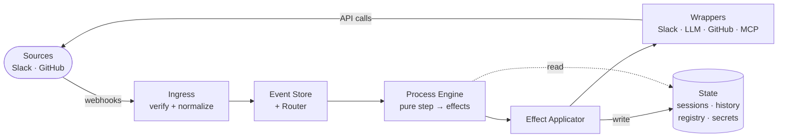
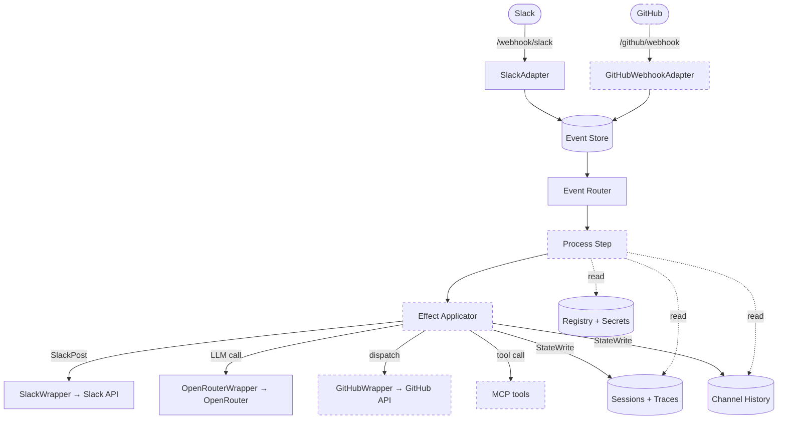

# Architecture

This is a living document. It focuses on design intent, invariants, rationale, and links to code for implementation details.

## Purpose

This repo is meant to be forked and adapted to personal or organizational use.
The long-term goal is an autonomous multi-agent system that behaves more like a team than a single assistant: a set of specialized agents can ingest requests and events, plan work, run tasks via tools/LLMs, measure impact against goals, and manage cost trade-offs.

This is a **strongly opinionated framework** focused on **Slack as the primary user experience layer**. By inheriting Slack's user management, channel-based permissions, and event-driven security model, the system gains easier onboarding, a more robust security posture, and a simpler authorization model compared to implementing custom user management.

## Reading Guide

Read until "Core Flows" for a high-level view of what exists today and where the design is headed. After that, the document becomes more technical and is most useful when you're changing or debugging a specific subsystem (timers, encryption, wrappers, or tests). "Deep Dives" links you directly to the implementation files for quick reference.

Sections and items marked **[planned]** describe target architecture not yet implemented. Unmarked content reflects the current codebase.

## Key Goals

- Quality and delivering a trustworthy experience is the primary goal, efficiency comes second.
- Keep the framework composable and extensible, so teams can adapt it either by forking it or by implementing their own Loops on top of the core.
- Make authorization and policy explicit at the controller and data classes layers.
- Process all webhook events through the event store and queued handler pipeline, rather than handling them inline at ingress.
- Make agent behavior observable and transparent in Slack threads, so each request can clearly show what actions were taken, what results were returned, what consequences or state changes followed, and how cost was incurred.
- Track performance and cost with enough structure to support ongoing improvements and optimization.
- Be safe-by-default: secrets encrypted at rest, HMAC verification of webhook events, conservative tool access, audit logs, non-training LLM subscription providers, etc.
- Slack-first: all write operations originate from Slack or internal Timers, with a clear "User" that is signing the request; all read operations are gated by short-lived, resource-based auth tokens.

## Non-Goals (for now)

- Cycles cost and top-ups.
- Frontend Canister to easily do the read operations, with short-lived tokens.
- Guaranteed perfect autonomy; humans remain in the loop via goals, preferences in operating procedures, policies, and approvals.

## System Overview

### Current implementation (today)

- Single Motoko backend canister receiving Slack events via `http_request` / `http_request_update`.
- Slack event adapter with HMAC-SHA256 signature verification and event normalization.
- Event store with lifecycle management (unprocessed → processed/failed) and per-event timer dispatch.
- Event router dispatching to handlers (message handler fully implemented, others stubbed).
- Workspace admin and custom orchestrators calling LLM services with function tools.
- Tool infrastructure: static function tool registry (resource-gated) and dynamic MCP tool registry.
- Metrics, value streams, and objectives models (org-level metrics, workspace-scoped value streams/objectives).
- API keys and secrets encrypted at rest using workspace-scoped derived keys (ICP Threshold Schnorr).
- LLM provider integration via HTTP outcalls (OpenRouter).
- Credential cascade implemented in secrets model (agent → workspace → org), with access audit logging. See [Credential Cascade](#credential-cascade).
- Identity and authorization derived from Slack, with workspace administration anchored on admin channels.
- Agent registry with `::` routing and category-based dispatch via Agent Router.
- Session tracking linking Slack message IDs to user auth context and agent execution context. Agent session model with per-agent persistent sessions, turn logs, and trace entries (see [src/control-plane-core/models/session-model.mo](src/control-plane-core/models/session-model.mo)).

Primary code entrypoint: [src/control-plane-core/main.mo](src/control-plane-core/main.mo)

### Target direction (what this architecture file plans for)

- **Multi-source webhook ingress**: The canister accepts writes from Slack (primary) and GitHub webhooks (agent session lifecycle and result callbacks). Each source has its own HMAC-SHA256 signature verification. Slack remains the primary user interaction layer.
- **[Agent Execution Types](#agent-execution-type)**: `#api` agents run in-canister calling LLM APIs directly; `#runtime(#githubCodingAgent)` agents run remotely in agent-specific GitHub repositories. The canister acts as control plane for both.
- **[GitHub Coding Agent integration](#core-flows)**: each `#runtime` agent is bound to its own repository; the canister dispatches via `workflow_dispatch`, tracks session state, and receives signed webhook callbacks with structured results.
- **Admin-channel-only workspace model**: each workspace is anchored by an admin channel. The member-channel concept and workspace member role are removed from the target model.
- **Agent channel allowlist**: each agent has an explicit list of Slack channels where it is allowed to run. Agents are still configured from the workspace admin channel, but execution is gated by this per-agent allowlist.
- **Out-of-allowlist behavior**: execution is blocked and the bot posts an automatic warning; enforcement details in [Agent routing and round control](#agent-routing-and-round-control).
- **[Process Engine (Loop Engine)](#process-engine-loop-engine)**: all agent invocations, multi-turn LLM conversations, and delegation chains are modelled as processes; `LoopEngine.step(process, event) → [Effect]` is a pure function executed by the Effect Applicator.
- **[Effect-driven execution](#effect)**: the only side-effect mechanism is the effect list returned by a process step — `StateWrite`, `SlackPost`, `EventEmit`, `ProcessSuspend`. Process logic never writes state or calls external APIs directly.
- **[Channel History](#channel-history)**: per-channel Slack message timeline, append-optimised, with retroactive edit support; the source material for agent context assembly, maintained independently of agents.
- **[Agent Session](#agent-session)**: one persistent session per agent with append-only turn log and immutable trace entries; built-in compaction, age-based context fidelity (raw fields for turns < 1h, truncated for older), and timer-based cleanup.
- **[Prompt context assembly and retrieval](#prompt-context-assembly-and-embedding-retrieval)**: on each LLM call, context is assembled from Agent Session, Channel History snippets, core files, memory, and Store documents, enriched by embedding-based retrieval against multiple indexes.
- **[Store](#store)**: file-like key-value store (`path`, `name`, `extension`, `description`, `content`) for persisting structured agent knowledge; paths must be absolute (start with `/`).
- **[Skill documents](#skill-documents-store-subtype)**: skills are Store documents under `/skills/<skill-id>/` paths, not a separate first-class system.
- **[Hierarchical credential management](#credential-cascade)**: org → workspace → agent credential cascade, with audit logging, secret-exposure scanning, and environment-variable isolation in the runner.
- **Agent Runner scope boundary**: runtime agent execution (Copilot session, tool use, file operations) lives in a dedicated GitHub repository. The control plane dispatches sessions, tracks state, and receives results — it does not contain the runner implementation. No "Store" file lives in Control Plane in this type of agent, to avoid out of sync issues.
- Read-only external access via resource-based, short-lived (1h) auth tokens generated within the canister (future).
- Interactive Messages (block actions, view submissions) for configuration and onboarding flows (future).
- **[DM Concierge agent](#dm-concierge-agent-planned)** [planned]: a stateless, informative-only agent permanently assigned to workspace 0 that handles all DM interactions. Because all other agents require an explicit channel allowlist, DMs are currently unserved; this agent is the sole exception. Equipped with tools to trigger the weekly reconciliation runner, query agent and workspace health, and surface recovery steps for common admin issues.
- **[Agent channel aliases](#agent-channel-aliases-planned)** [planned]: agents can register short, human-friendly aliases scoped to a specific Slack channel (e.g., `::Admin`, `::Alice`). The Event Router alias resolver maps the alias to the canonical agent name before dispatch, so users never need to type the globally unique agent identifier inside a channel where the alias is unambiguous.

### System flow diagram

#### Pipeline overview

#### Component detail

Dashed borders indicate planned components not yet implemented.

## Architecture Principles

- Separation of concerns (control plane layers):
  - **Controller layer**: authentication/authorization/validation at the canister update boundary.
  - **Ingress layer**: verify HMAC signatures, normalize raw webhook payloads into typed events, and enqueue for dispatch. No business logic; pure parsing and validation.
  - **Event Dispatch**: claim events from the queue and route by `event.type` to the appropriate process handler.
  - **Process Engine (Loop Engine)**: pure functional step model — `Process.step(process, event) → [Effect]`; process logic is deterministic and never side-effects directly. [→ know more](#process-engine-loop-engine)
  - **Effect Applicator**: executes effects returned by the Process Engine; the only place where state is written or external APIs are called. [→ know more](#process-engine-loop-engine)
  - **Wrappers**: encapsulate external API calls (Slack, GitHub, LLM providers, MCP Servers); called by the Effect Applicator. [→ know more](#tooling-and-integrations)
- Verified-source security: all webhook operations must originate from a verified source — Slack events (HMAC-SHA256 with signing secret) or GitHub webhooks (HMAC-SHA256 with webhook secret). The canister never trusts a hook that doesn't come through a verified signature. Slack remains the only user interaction layer.
- **Controller-only surface**: the canister exposes `http_request` and `http_request_update` as its public HTTP gateway — these are the webhook ingress points protected by per-source HMAC verification (see Verified-source security above). Beyond that gateway, the only other exposed `update` methods are controller-restricted — callable solely by the canister controller principal and limited to critical secret setup and recovery operations. All other system activity is internal: timer-fired work (scheduled) or event-queue dispatch. Timer-fired operations or queue-dispatched operations may be system- or user-triggered. User-triggered operations are always attributed to both the agent executing them and the Slack user who originated the request chain.
- **Least-privilege, capability-scoped control**: grant a minimal tool set and Slack channel allowlist rather than micro-managing individual actions. Do not interrupt flows for decisions that have already been approved at the capability level — trust previously established allowlists and policies. Control at the capability boundary (which effects and tools an agent may invoke) rather than at the action level. For powerful but necessary tools (e.g., `browser`), prefer constraining _what they can reach_ (URL/domain firewall) over removing the tool entirely.
- Specialized agents is desired as a strategy (Lower input/context window, easier A/B testing for cost/quality optimizing, lower risk on model upgrading) over a single, big, monolithic agent that accumulates very distinct domains.
- Auditable: the system should be auditable (events, session, secrets and effects).
- Agent isolation: a process step must never invoke another agent process directly. Inter-agent communication flows through the `SlackPost` effect (posting to Slack), which re-enters the system as a new Slack event — ensuring every hop is auditable, budget-checkable, and recorded in each agent's session.

## Core Concepts

### Workspace

The ultimate owner of agents and it's configuration, including: policies, stored files, processes/Loops. Each workspace maps to:

- `id`: unique numeric identifier (0 = the org workspace, always exists).
- `name`: human-readable name.
- `adminChannelId`: Slack channel ID whose members are workspace admins.

Target model note: workspaces no longer define a member channel. Agent execution access is controlled by per-agent Slack channel allowlists.

### User Auth Context

The resolved identity and permissions of the user who initiated a request. Built from the Slack user cache at event-processing time and passed into all agent process handlers. Contains:

- `slackUserId`: the Slack user ID.
- `isPrimaryOwner`: whether this user is the Slack Primary Owner.
- `isOrgAdmin`: whether this user is a member of `#looping-ai-org-admins`.
- `adminWorkspaces`: set of workspace IDs where the user is an admin — `Set<Nat>`.

The `userAuthContext` is the single source of truth for authorization in all downstream operations. It is carried through agent delegations: when agent A references agent B (on a Slack Message), the `userAuthContext` of the original human user is inherited, not the agent's identity.

### Agent Session

A persistent, long-lived record per agent — not per message or per request. Exactly one session exists per `agentId` (no separate session ID); sessions are never archived or deleted independently. The session is the agent's memory container, structured as: **session record** (turn sequencing, compaction state, context-budget policy) → **turn log** (append-only execution episodes) → **trace log** (append-only per-turn operation records).

The session does not duplicate Channel History — it stores only agent-specific execution data.

**Key invariants**: isolation is agent-scoped (no access to channels the agent isn't invited to); compaction [planned] never drops events, only reduces granularity; cleanup hard-deletes turns older than 3 months while summary layers are the permanent record.

See [src/control-plane-core/models/session-model.mo](src/control-plane-core/models/session-model.mo) for the session, turn, and trace field definitions, plus session CRUD and turn cleanup behavior.

### Agent Turn

A single execution episode within an Agent Session. Turns are append-only, ordered by a monotonic `turnNumber`, and identified by a deterministic `turnId` (`"{agentId}_{turnNumber}"`). Each turn records its status, what triggered it (`sourceRef`), delegation lineage (`triggerTurnId` — walking these links reconstructs the full delegation chain), a `userAuthContext` snapshot, and aggregated cost.

Delegation lineage is carried via Slack metadata (`AgentMessageMetadata`), not a separate index.

### Turn Trace

An immutable, append-only log of execution events within a single turn. Each `TurnTraceEntry` is a self-contained record of one completed operation — no started/finished pairing. Variant tags on `detail : TraceDetail` distinguish entry types: `#llmCall`, `#toolCall`, `#slackPost`, `#contextAssembled`, `#roundLimitHit`, `#policyRejection`, `#faultRecovered`.

**Key invariants**: trace entries are never mutated or deleted by the maintenance worker. Truncation is pre-computed at trace write time into `truncatedContent`/`truncatedOutput` fields; the raw originals (`content`/`output`) are always retained. Context assembly uses raw fields for turns completed (or started) within the last hour, and truncated fields for older turns. Thinking blocks are logged in traces but excluded from context assembly. A cleanup timer hard-deletes entire turns (with their traces) older than 3 months.

### Agent

A named, configurable entity that uses an LLM with specific tools and skills. Agents are registered in a persistent agent registry and referenced via the `::` syntax in Slack messages.

### DM Concierge Agent [planned]

A special-purpose agent permanently assigned to workspace 0 (the org workspace). Because every other agent requires an explicit `allowedChannelIds` entry and DMs are not Slack channels, DMs are currently unserved. The DM Concierge is the sole exception to the channel allowlist requirement — it handles any DM directed at the bot.

Key characteristics:

- **No memory / no learning**: does not write to Agent Session or Channel History. Each interaction is fully stateless.
- **Informative only**: can answer questions about the system, agent availability, and channel routing, and guide users to the right channel or agent.
- **Admin recovery tools**: equipped with tools to trigger the weekly reconciliation runner and surface its output directly in the DM; query workspace and agent health; and walk users through common recovery flows (e.g., missing org admin channel membership, misconfigured agent allowlists).
- **Belongs to workspace 0**: cannot be moved to a workspace-specific workspace. Secret access is limited to org-level secrets only.
- **Single instance**: only one DM Concierge exists. It is bootstrapped automatically alongside workspace 0 and cannot be deleted.

### Agent Execution Type

Agents have one of two execution types:

- **`#api`**: Runs inside the canister. The canister calls LLM APIs directly (OpenRouter), executes tool loops in-canister, and posts replies to Slack. Uses canister-level secrets (e.g., OpenRouter API key). Examples: workspace-admin, custom agents.
- **`#runtime(#githubCodingAgent)`** [planned]: Runs remotely through GitHub Coding Agents in an agent-specific repository. The canister dispatches a workflow run (`workflow_dispatch`) with the session payload, receives a structured result via signed GitHub webhook, then composes and posts the final Slack reply.

The `AgentRouter` branches on execution type before dispatching. The `#runtime` variant is extensible for future runtime types beyond GitHub Coding Agents.

### Agent Category

A class of agent behavior (`#admin`, `#onboarding`, `#custom`). Each category defines:

- `category_tools`: the set of tool enum variants available to agents in this category.
- LLM model selection strategy.
- Template Skills and source/knowledge configuration.

### Policies (future)

Text-based rules governing what is allowed or not. Applied at the workspace level to constrain tasks, tools, budgets, and permissions. From these text based documents, logic rules are captured and converted into Dynamic Logic, formal logic, rules. Then they should be upheld when accessing tools. Maybe consider using an adaptation of Cedar Policy framework https://github.com/cedar-policy/cedar-authorization.

Policy enforcement follows the capability-scoped control principle: policies grant or restrict capabilities (tool access, allowed channels, spend limits) rather than gating individual actions. An approved capability should flow without interruption unless the policy explicitly narrows or limits it further.

### Events

Normalized inbound signals derived from verified external sources (Slack, GitHub).
All system state mutations are driven exclusively by Events (or internally scheduled Tasks).
Each event source has its own HMAC-SHA256 signature verification — Slack uses a signing secret and GitHub uses a webhook secret.
Slack remains the primary user interaction layer; GitHub webhooks handle runtime session lifecycle and agent response delivery.

### Processes [planned]

The sources of system activity are: (a) a verified inbound webhook (Slack or GitHub), (b) an event emitted by the system itself via the `EventEmit` effect — either immediately or after a delay (timer/heartbeat), and (c) controller-only operations restricted to the canister controller principal (secret setup and recovery only). There is no other entry point.

Work is modelled as **Processes**: stateful, multi-step computations driven by events and returning effects.

### Process [planned]

A stateful, multi-step computation driven by events. A process encapsulates its current step state, accumulated context, and a resume trigger for suspended continuations. Each step is computed by `Process.step(process, event) → [Effect]` — a pure function that never side-effects directly. Processes can be suspended (`ProcessSuspend`) waiting for a future event (e.g., a GitHub webhook callback, a timer tick) and resumed when it arrives.

### Effect [planned]

A declarative, type-safe description of a side effect, returned by a process step and executed by the Effect Applicator. Effect types:

- `StateWrite`: persist a state mutation.
- `SlackPost`: post a message to a Slack channel or thread; returns a Slack `ts` used downstream.
- `EventEmit`: schedule an event — immediate (next dispatch loop tick) or delayed (timer-based cron emulation).
- `ProcessSuspend`: park the process in the process store until a specified future event arrives.

Separating pure process logic from effect execution makes the Process Engine testable without any external dependencies.

### Store [planned]

A file-like key-value store for persisting structured and unstructured agent knowledge. Each entry has `path`, `name`, `extension`, `description`, and `content`, with `#read` / `#write` access modes. Paths must be absolute (start with `/`); the system normalizes non-absolute paths automatically. The store supports hierarchical paths like a real folder tree.

`description` is metadata designed for LLM guidance: the file purpose, expected update cadence, and interaction rules. In the control plane, Store entries are canister-persisted map entries. In the Agent Runner, they map to git-tracked files with auto-backup.

### Channel History

A timeline of Slack messages for a single channel — who said what and when. Channel History is the raw source material; it does not belong to any agent. All agents that are allowlisted to a channel draw from the same Channel History. It is stored in the `channelHistoryStore` and retained with a time-based expiry.

Writes are the common case (new messages), but Slack can send `message_changed` events for edited messages at any time. The structure is optimised for writes and the common read path, with retroactive edits applied when the corresponding event arrives. No strict immutability is assumed.

### Prompt Context Assembly and Embedding Retrieval

At each LLM call, the control plane assembles a turn-specific context from multiple sources, ordered oldest → newest.

1. **Compacted session summaries**: `coldSummary` → `warmSummary` → `hotSummary` (compressed history layers from the Agent Session).
2. **Raw turns**: uncompacted turns after `lastCompactedTurnId` (recent, full-fidelity interaction traces; context assembly uses raw fields for turns < 1h old, truncated fields for older turns — see [Turn Trace](#turn-trace)).
3. **Channel History snippets**: selected messages from channels the agent is invited to, relevant to the current prompt.
4. **Core files** [planned]: policy, config, and identity documents.
5. **Store documents and embeddings** [planned]: including skill documents under `/skills/`. The current user prompt is embedded at call time and used to query embedding indexes for memory, core files, and Store documents (with optional `path` filtering).

This retrieval step is dynamic and per-call; it enriches context beyond Agent Session without mutating the session. Token budgets for each layer are deterministic, governed by `summaryTokenBudget` in the session policy (halving distribution — see [Agent Session](#agent-session)).

### Skill Documents (Store Subtype) [planned]

Skills are not a separate first-class state model; they are a structured subtype of Store documents. A skill is represented by files under a skill path (for example, `/skills/create-spec/SKILL.md` plus optional companion files), using Store metadata and content.

This keeps one unified persistence model while still enabling skill-specific conventions for discovery, retrieval, and updates.

## External Interfaces

### Write Surface — Verified Webhooks

All write operations enter the canister through verified webhook endpoints:

- **Slack Events API** (`http_request_update` at `/webhook/slack`): messages, app mentions, channel membership changes, interactive message callbacks. HMAC-SHA256 with Slack signing secret + timestamp replay protection.
- **GitHub Webhooks** [planned] (`http_request_update` at `/github/webhook`): workflow lifecycle and runtime agent session result callbacks from GitHub Actions. HMAC-SHA256 with `X-Hub-Signature-256` header using a stored GitHub webhook secret.
- **Slack API** (outbound HTTP outcalls): the canister calls Slack to post messages, read user lists, and read channel memberships.

No public canister `update` methods are exposed for external clients. Controller-restricted methods (callable only by the canister controller principal) exist for secret setup and recovery but are not part of the webhook surface — see "Controller-only surface" in Architecture Principles. Each webhook source has its own signature verification as the authentication layer.

### Read Surface — Token-Gated Queries [planned]

All external read access requires a **resource-based, read-only, short-lived (1h) auth token**:

- Tokens are generated inside the canister, triggered by a Slack command from the user.
- Token generation is logged for any future access audit.
- Each token maps to `{ slackUserId, isOrgAdmin, workspaceAdminScopes: [workspaceId], resourceScope, expiry }`.
- Query methods validate the token, check expiry, and return scoped data.
- Token storage is persistent, short-lived (1h) and cleaned up on a weekly Timer.
- No sensitive or personal data is exposed — only aggregated stats and summaries scoped to the token's access level.

This design aligns with security best practices: short-lived tokens, server-side generation, logged access, and minimal data exposure.

### Interactions

- **Slack** (primary, implemented): Events API, Web API (`postMessage`, `users.list`, `conversations.list`, `conversations.members`).
- **GitHub** (planned): GitHub Actions APIs for `workflow_dispatch` session execution, run status APIs, and webhook delivery for agent session lifecycle and result callbacks.
- **OpenRouter** (implemented): OpenAI-compatible chat completions API used by canister `#api` agents via HTTP outcalls. Supports BYOK — no need to configure specific API provider keys in the repo; free tier covers up to 1M calls/month.
- **Slack Interactive Messages** (future): `block_actions` and `view_submission` payloads for configuration and onboarding UX.

## Core Flows

### Slack event processing (current)

1. Slack sends an event to `http_request_update`.
2. `SlackAdapter` verifies the HMAC-SHA256 signature (with timestamp replay protection).
3. `SlackAdapter` parses the raw JSON into typed structures and normalizes into an internal `Event`.
4. `EventStoreModel` enqueues the event (dedup check across all maps).
5. A `Timer.setTimer(#seconds 0)` fires `EventRouter.processSingleEvent`.
6. The router claims the event, dispatches to the appropriate handler.
7. The handler executes (e.g., calls LLM via orchestrator, posts reply to Slack).
8. Event is marked as processed or failed.

### Agent talk flow — `#api` execution (current)

1. Message handler receives a normalized message event.
2. Scopes workspace data, derives encryption key, decrypts secrets.
3. Calls orchestrator → LLM service (OpenRouter).
4. Multi-turn LLM conversation loop (up to 10 iterations) with function tool calling.
5. Posts reply to Slack via `SlackWrapper.postMessage` (threaded if original was threaded).

### Agent talk flow — `#runtime(#githubCodingAgent)` execution (planned)

1. Message handler receives a normalized message event referencing a `#runtime(#githubCodingAgent)` agent.
2. Resolves the agent's GitHub repository and workflow from agent runtime configuration.
3. Resolves required secrets via credential cascade and prepares a signed session payload.
4. Canister triggers `workflow_dispatch` in the agent repository via GitHub API.
5. GitHub Actions runs the session in the agent repo and emits lifecycle events.
6. GitHub posts a signed webhook callback with structured session result payload to `/github/webhook`.
7. Canister correlates `requestId/sessionId`, injects response into the conversation context.
8. Canister composes the final Slack reply and posts it.

### Agent repository binding flow (planned)

1. Workspace admin configures a runtime agent with repository metadata (owner/repo, workflow file/ref, branch/ref constraints).
2. Canister validates repository reachability and workflow availability through GitHub API.
3. Canister stores runtime configuration in the agent record (`#runtime(#githubCodingAgent)` config).
4. Future sessions for that agent dispatch only to that configured repository/workflow.

### Agent-to-agent delegation (planned)

1. User sends `@looping ::accounting deliver me a report on last financials`.
2. Event router resolves `::accounting` from the agent registry, builds `userAuthContext` from `SlackUserModel` (the Slack user cache).
3. `::accounting` agent process creates a new turn in its session, executes, and determines it needs data from `::tech`.
4. `::accounting` posts a Slack message referencing `::tech` (architectural invariant: never invoke another agent process directly). The message metadata includes `turnId` of the originating turn.
5. That message triggers a new Slack event → event router picks it up.
6. Router reconstructs the `userAuthContext` from the parent turn's metadata. Routing round progression and termination checks are loaded from `SessionsModel`. A new turn is created in `::tech`'s session with `triggerTurnId` pointing to `::accounting`'s turn.
7. `::tech` processes with the original user's access scopes but its own tools/skills.
8. `::tech` replies → new event → router returns control to `::accounting`.
9. `::accounting` compiles the report and replies to the original user.
10. If sensitive data was accessed at a higher level than the channel allows, the bot sends a generic acknowledgement in the original channel and delivers the detailed reply in the user's DM or the appropriate scoped channel.

### Token generation flow (planned)

1. User sends a DM to the bot requesting access (e.g., a command or prompted text).
2. Bot resolves user's `userAuthContext` from the Slack user cache.
3. Bot generates a resource-based, read-only token inside the canister using the resolved `SlackUserEntry`. Stores `{ slackUserId, isOrgAdmin, workspaceAdminScopes: [workspaceId], resourceScope, expiry: now + 1h }`.
4. Bot replies in the DM with the token (or a link containing it).
5. External client (frontend) uses the token to call query methods.
6. Frontend may provide an easy-to-copy Slack prompt so users can request new tokens when they expire.

### App install and setup flow (planned)

1. On install, the bot calls `conversations.list` and `users.list` via SlackWrapper.
2. Identifies the Primary Owner from: the user in `users.list` with `is_primary_owner: true`.
3. Checks if a channel named `#looping-ai-org-admins` exists.
   - If yes: stores its **channel ID** as the org admin channel anchor. Populates org admin list from channel members.
   - If no: sends a DM to the Primary Owner requesting creation of the channel.
4. Weekly reconciliation verifies the org admin channel: channel ID still exists and name still matches.
   - Same ID, renamed → flag but don't break (notify Primary Owner to confirm).
   - ID gone → recovery mode (DM to Primary Owner).
   - Different ID now but has the name → suspicious, recovery mode (DM to Primary Owner).
5. From the `#looping-ai-org-admins` channel, admins set up workspaces via interactive messages.

### Workspace onboarding (planned)

1. An org admin in `#looping-ai-org-admins` requests to create a new workspace.
2. Bot presents an interactive message: workspace name and selection of the admin channel (public or private where bot has access), or manual channel ID entry.
3. If the selected channel is not accessible, the bot guides the user to run `/invite @looping` in that channel first.
4. Bot creates the workspace record and enables agent configuration from that admin channel (including per-agent channel allowlists).

## State Model

### Current persistent state

See [src/control-plane-core/main.mo](src/control-plane-core/main.mo).

- `agentRegistry`: global agent registry with dual index by ID and name (Phase 1.1, implemented).
- `channelHistoryStore`: channel-keyed, timeline-structured message history stored via `ChannelHistoryModel`, with 1-month ts-based retention (Phase 1.4, implemented). Replaces old `conversations` / `adminConversations` workspace-keyed maps. Messages carry `userAuthContext` for identity/authorization snapshot only. Routing round progression and force-termination state are tracked in `SessionsModel`, not in channel history messages.
- `slackUsers`: Slack user cache (`SlackUserEntry` records indexed by Slack user ID); populated by event-driven membership events and weekly reconciliation.
- `workspaces`: workspace channel anchors (`WorkspaceRecord` indexed by workspace ID, each with `adminChannelId`). Workspace 0 ("Default") is the org workspace; its `adminChannelId` serves as the org-admin channel anchor.
- `secrets`: encrypted secrets per workspace.
- `mcpToolRegistry`: dynamic MCP tool registry.
- `metricsRegistry` / `metricDatapoints`: org-level metrics.
- `workspaceValueStreams` / `workspaceObjectives`: workspace-scoped value streams and objectives.
- `eventStore`: event lifecycle (unprocessed/processed/failed).
- `httpCertStore`: HTTP certification state.

### Target persistent state

- **Workspaces**: `Map<workspaceId, WorkspaceRecord>` where `WorkspaceRecord = { id, name, adminChannelId }`. Workspace 0 ("Default") is the org workspace; its `adminChannelId` serves as the org-admin channel anchor — no separate state variable needed.
- **Slack user cache**: `Map<SlackUserId, SlackUserEntry>` where `SlackUserEntry = { slackUserId, displayName, isPrimaryOwner, isOrgAdmin, workspaceAdminScopes: [workspaceId] }`. Backed by `SlackUserModel`.
- **Agent registry**: `AgentRegistryState = { nextId, agentsById: Map<Nat, AgentRecord>, agentsByName: Map<Text, Nat> }` where `AgentRecord = { id, name, category, executionType: #api | #runtime(#githubCodingAgent({ repoFullName, workflowId, ref })), workspaceId, llmModel, allowedChannelIds: [Text], secretsAllowed: [(workspaceId, SecretId)], secretOverrides: [(SecretId, Text)], toolsAllowed, toolsState: Map<Text, ToolState>, usageStats, sources }`. Dual-index for O(1) lookup by ID or name. File: [src/control-plane-core/models/agent-model.mo](src/control-plane-core/models/agent-model.mo).
- **Agent session store**: `Map<agentId, AgentSessionRecord>` — one persistent session per agent, with compaction state (summary layers, cursor) and context-budget policy. No separate session ID; the agent ID is the key. File: [src/control-plane-core/models/session-model.mo](src/control-plane-core/models/session-model.mo).
- **Agent turn store**: `Map<agentId, List<AgentTurnRecord>>` — append-only turn log per agent. Each turn has a deterministic `turnId` (`"{agentId}_{turnNumber}"`), execution status, source ref, delegation lineage (`triggerTurnId`), user auth context snapshot, cost, and Slack reply ts list.
- **Turn trace store**: `Map<turnId, List<TurnTraceEntry>>` — immutable, append-only trace per turn. Each entry is a self-contained `TraceDetail` variant (`#llmCall`, `#toolCall`, `#slackPost`, etc.) with per-entry cost on LLM calls. Truncated fields (`truncatedContent`, `truncatedOutput`) are pre-computed at write time; raw originals always retained. Context assembly uses raw fields for turns < 1h old, truncated fields for older turns. Hard deletion after 3 months.
- **GitHub runtime session store**: `Map<sessionId, GithubAgentSessionRecord>` where `GithubAgentSessionRecord = { sessionId, agentId, repoFullName, workflowId, runId: ?Nat64, status: #queued | #running | #succeeded | #failed | #cancelled | #unknown, requestId, startedAt, completedAt, lastWebhookAt, lastError }`. Tracks remote execution lifecycle and callback correlation. File: `src/control-plane-core/models/github-agent-session-model.mo` (new).
- **Embedding indexes**: searchable indexes for memory records, core files, and Store documents (including skill documents under `skills/`) used during prompt-time retrieval.
- **Auth token store**: `Map<tokenId, TokenRecord>` with `{ slackUserId, isOrgAdmin, workspaceAdminScopes: [workspaceId], resourceScope, expiry }`. Cleaned up on Sundays in a Timer.
- **Secrets**: encrypted secrets per workspace. Includes `#custom(Text)` secret types for flexible credential mapping. Per-workspace audit state: `SecretAuditState = { changeLog: List<SecretChangeEntry>, accessLog: List<SecretAccessEntry> }` tracking stores, deletes, and accesses with timestamps and sources.
- **Channel History**: channel-keyed, timeline-structured persistent store (Phase 1.4, implemented). Each channel has posts and threads indexed by Slack timestamp, with 1-month ts-based retention. See [src/control-plane-core/models/channel-history-model.mo](src/control-plane-core/models/channel-history-model.mo) for the `ChannelHistoryStore` structure: `Map<channelId, ChannelStore>` where `ChannelStore = { timeline: Map<ts, TimelineEntry>, replyIndex: Map<ts, rootTs> }`. `TimelineEntry` is either a `#post` (top-level message) or `#thread` (root + replies). Messages carry `userAuthContext` (null for bot replies, set for user messages) enabling LLM role mapping without additional lookups. Tool call/response artifacts are ephemeral (in-memory only, not persisted) pending Phase 1.7 session tracking.
- **Event store**: event lifecycle with timer dispatch (existing, retained).
- **Metrics / Value Streams / Objectives**: existing models retained.
- **Tool registries**: function tool registry (static) and MCP tool registry (dynamic), with new per-agent `toolsAllowed` and `toolsState`.

### Transient state

- Key-derivation cache (cleared periodically, re-derived on demand).

## Identity, Roles, and Authorization

### Slack-derived identity

The canister does not manage its own user accounts. All identity is derived from Slack:

- **Primary Owner**: the Slack user with `is_primary_owner: true` in `users.list`. Has ultimate administrative authority. Recovery flows (e.g., lost org admin channel) are directed to this user via DM.
- **Org Admin**: a member of the `#looping-ai-org-admins` channel, identified by channel ID.
- **Workspace Admin**: a member of a workspace's designated admin channel.

### SlackAuthMiddleware

Replaces the current Principal-based `AuthMiddleware`. At event-processing time:

1. Extracts the Slack user ID from the event payload.
2. Looks up the user in the Slack user cache.
3. Resolves their access level and workspace scopes.
4. Builds a `UserAuthContext` that is passed to all downstream services.

All authorization decisions are based on the `UserAuthContext`, not on IC caller Principals.

### User cache synchronization

**Real-time (event-driven, primary):**

- `member_joined_channel` → add user to the workspace's role set.
- `member_left_channel` → remove user from the workspace's role set.
- `team_join` → add user to the cache with default (no workspace) membership.

**Weekly reconciliation (Sundays, fallback):**

- Full `users.list` + `conversations.members` sweep for all tracked channels.
- Corrects any drift from missed events.
- Also verifies all tracked channel IDs still exist:
  - **Org admin channel**: follows its own recovery rules (see "App install and setup flow").
  - **Workspace admin channel gone**: notify `#looping-ai-org-admins`, request that an org admin assigns a new admin channel or requests workspace deletion.
  - **Agent allowlist drift**: detect channels that no longer exist or are no longer accessible and notify workspace admins to repair affected agent allowlists.

### Access scoping on models and tools

Resources have read/write visibility levels: `org`, `admin`.

Model examples:

- Objectives: `read: org`, `write: admin`.
- Tasks: `read: org`, `write: org`.

Tool examples:

- `web_search`: org access.
- `mcp_send_social_post`: org access.
- `mcp_send_job_opening`: admin access.

No individual access configuration is allowed. If truly needed, the org admin can create a workspace with only that individual and explicitly assign the desired resources and tools.

### Access level resolution [planned]

The access level is always determined by the **user** who wrote the original message, regardless of which channel the message was sent in. When an agent replies:

- If the reply contains data that required a higher access level than the current channel's scope, the bot sends a **generic safe acknowledgement** in the original channel.
- The **detailed reply** is delivered in the user's DM, or the appropriate scoped admin/allowed channel.
- This split-reply behavior is determined after the LLM generates its response, by inspecting the processing steps to see if a higher scope was accessed.

## Agent System

### Agent registry

Agents are stored in a persistent registry with dual indexes (`agentsById: Map<Nat, AgentRecord>`, `agentsByName: Map<Text, Nat>`) for O(1) lookup by ID or name. Each agent record (`AgentRecord`) has:

- `id`: stable unique numeric identifier, assigned by the registry on registration.
- `name`: kebab-case identifier, must be unique and match the `::name` syntax. Stored lower-cased; lookups are case-insensitive.
- `category`: which agent category/service handles this agent (e.g., `#admin`, `#onboarding`, `#custom`).
- `executionType`: determines how the agent runs — `#api` (in-canister, calls LLM directly) or `#runtime(#githubCodingAgent({ repoFullName, workflowId, ref }))` (remote, via GitHub Actions workflow dispatch). See "Agent Execution Type" in Core Concepts.
- `workspaceId`: which workspace this agent belongs to. Scopes ownership and secret access.
- `llmModel`: the LLM provider and model to use (e.g., `#openRouter(#gpt_oss_120b)`).
- `allowedChannelIds`: explicit Slack channel allowlist for agent execution. If a message references the agent outside this list, execution is blocked with an automatic warning.
- `secretsAllowed`: explicit whitelist of `(workspaceId, SecretId)` pairs this agent is permitted to access. The agent process must check this list before decrypting any secret.
- `secretOverrides`: `[(targetSecretId: SecretId, customSecretName: Text)]` — agent-level credential override; see [Credential Cascade](#credential-cascade).
- `toolsAllowed`: subset of the category's `category_tools` that this agent is permitted to use.
- `toolsState`: per-tool runtime state (`Map<Text, ToolState>`):
  - `usageCount`: how many times this tool has been invoked by this agent.
  - `knowHow`: a Text field containing tool-specific operational knowledge — configuration state, secret key references (how to find them in Secrets), good/bad practices, documentation links, and other relevant context. This field is also used when duplicating an agent as a template: the know-how can be copied and adapted.
- `usageStats`: `{ totalPromptTokens, totalCompletionTokens, totalRequests, lastResetAt }` — accumulated from LLM responses for cost tracking.
- `sources`: knowledge sources and context configuration.

### `::` reference syntax

Users (or agents) reference agents in messages with the `::` prefix notation.

**Trigger**: `::agentname`

**Regex**: `(?<!\\)(?<!\w)::([a-z][a-z0-9-]*)`

**Ignored contexts**: inline code, code blocks, escaped `\::agent`.

**Validation**: the name must exist in the agent registry. Case-insensitive matching.

When an agent is referenced, the access scope remains that of the original user. The agent uses its own skills and tools, but scoped to the original user's `userAuthContext`.

### Agent Channel Aliases [planned]

Agents can register short, human-friendly aliases scoped to a specific Slack channel. This lets channel members write `::Admin` or `::Alice` instead of the globally unique canonical name (`::ws-1-admin`, `::alice-2`). Aliases only need to be unique within their channel — the same alias can exist in different channels pointing to different agents.

**Model**: the registry maintains a secondary index `channelAliasIndex : Map<(channelId, alias), agentId>`. An alias is a kebab-case, lowercase text string following the same character rules as an agent name. Aliases are stored case-insensitively.

**Registration rules**:

- Two agents cannot hold the same alias in the same channel — registration is rejected if a conflict exists.
- An alias may shadow the canonical name of a _different_ agent only if that agent is not allowlisted in the channel.
- Aliases are configured per-agent from the agent's workspace admin channel, alongside `allowedChannelIds`.

**Alias resolution in the Event Router** (runs after the existing `::agentname` extraction):

1. Extract `::reference` tokens as today.
2. Attempt exact name lookup in the agent registry (current behavior — unchanged).
3. If no exact match, perform a channel-scoped lookup: `channelAliasIndex[(channelId, reference)]`.
4. If found, treat the resolved agent as if its canonical name had been referenced — all downstream logic (session tracking, turn log, trace entries) uses the canonical name.
5. If still not found, discard the event as today.

Alias resolution is transparent: once resolved, nothing downstream is aware that an alias was used.

### Agent categories

Each agent category defines the process logic that handles execution:

- `category_tools`: an array of tool enum variants available to agents in this category. This type structure is also used when configuring agent tool permissions through Slack interactive components.
- LLM model selection strategy.
- Store-backed knowledge configuration (including skill documents).

**Phased implementation:**

- **v0.2**: Agent registry, `::` routing, admin and planning agent process handlers, Slack-only write surface.
- **v0.5**: Agent execution types (`#api` / `#runtime`), GitHub Coding Agent integration via Actions + webhooks, credential cascade, secrets hardening, Process Engine + Effect Applicator, Agent Session, Channel History, Store.
- **Future**: Full pluggable agent framework, interactive Slack messages, auth tokens, cost optimization, and richer Store document conventions.

### Agent routing and round control

The **Agent Router** sits between Event Dispatch and agent process handlers.

**Pre-conditions (checked before routing begins):**

- The message must contain at least one **valid `::agentname` reference** — resolved against the agent registry at dispatch time. If no valid reference is found (e.g., the reference doesn't match any registered agent), the event is **discarded/skipped**. This prevents orphaned or malformed inter-agent messages from entering the routing loop.
- The request chain must not be force-terminated in `SessionsModel`. If the chain is marked terminated, the event is **discarded/skipped** without invoking any agent process.
- The Slack channel must be present in the referenced agent's `allowedChannelIds`. If not, the router posts a warning with the allowed channels and skips execution.

Both conditions are checked at the event router level, before the Agent Router hands off to a category service.

When a message passes pre-conditions and references an agent:

1. Resolves the agent from the registry.
2. Selects the appropriate category service.
3. Passes the `userAuthContext` and session context to the service.
4. The service executes and posts a reply to Slack.

**Round tracking** (in `SessionsModel`):

- `roundCount` increments each time the router processes a new event in the same request chain.
- **Hard upper bound**: `MAX_AGENT_ROUNDS` (10, defined in Constants). Once this limit is reached, the session is force-terminated.
- **Invariant**: an agent process must never directly invoke another agent process. The "connection" is always a `postMessage` on Slack that triggers a new round through an event. This ensures every hop is auditable, traceable, and budget-checkable.

## Process Engine (Loop Engine) [planned]

### Process model

The Process Engine implements a pure functional step model: a process step is a pure function that takes the current process state and a triggering event and returns a list of effects. No state is mutated and no I/O is performed inside the step function.

For LLM-bound steps, context assembly is explicit: the step prepares a retrieval request that combines Agent Session context with external knowledge layers (core files, memory, and Store documents, including `skills/`). The embedding lookup and fetch are executed by effect handlers/wrappers, then fed back into the next step as inputs.

The **Effect Applicator** then executes the returned effects in order (see [Effect](#effect) for type definitions): `StateWrite` → `SlackPost` → `EventEmit` → `ProcessSuspend`. The `ts` returned by `SlackPost` is available to subsequent effects in the same batch.

### Process lifecycle

`created → running → suspended → running → … → {succeeded | failed | cancelled}`

A suspended process is re-awakened when its resume trigger event arrives and is matched by Event Dispatch. Retry logic is handled by emitting a delayed `EventEmit` that re-triggers the same step.

### Process record

Each process stores:

- `processId`: stable unique identifier.
- `workspaceId`: owning workspace.
- `initiator`: Slack user ID from `userAuthContext`.
- `capabilitiesSnapshot`: tool allowlist + budget ceilings captured at process creation time.
- `idempotencyKey`: deduplication across retried events.
- `currentStep`: the step tag or function reference.
- `suspendedAt` / `resumeTrigger`: set when `ProcessSuspend` is applied; cleared on resume.
- `auditMetadata`: timestamps, attempt count, last error.

### Execution responsibility

- Ingress handlers enqueue an event and return immediately — no awaits at ingress.
- Event Dispatch claims events one at a time and invokes `Process.step`.
- The Effect Applicator owns all I/O: Slack posts, state writes, timer scheduling, and external API calls via wrappers.
- Prompt-time embedding retrieval (memory/core-files/Store docs) is executed via wrappers/effects and injected into the LLM call context for that step.
- Long-running external work (LLM calls, GitHub API calls) is mediated through effects, not inline awaits inside step functions.

## Concurrency and Await Safety

Internet Computer execution can interleave at `await` points.
Design rules (planned and recommended for any new code):

- Update process status to `running` before the first `await`.
- Wrap with try {} catch to log trap messages and keep history of trap logs for future audit.
- Make processes step-based with logged transitions at every await — if a trap occurs, completed steps are skipped and execution restarts at the failed step.

## Timers and Scheduling

### Current

- Key-derivation cache clearing timer (30 days).
- Metric datapoints retention cleanup timer (30 days).
- Processed events cleanup timer (7 days): fails stale unprocessed events, purges old processed/failed events.
- Keep timer state minimal and upgrade-safe (store "next run time" and reschedule in `postupgrade`).

Relevant code: [src/control-plane-core/main.mo](src/control-plane-core/main.mo)

### Planned

- **Weekly reconciliation timer** (Sundays): full Slack user and channel membership sync. Also verifies workspace and org admin channel IDs.
- **Auth token purge timer**: periodic cleanup of expired tokens.
- **Session compaction timer**: periodic pass over agent sessions; compacts raw turns into summary layers when token budget thresholds are exceeded.
- **Turn cleanup timer** (monthly): hard-deletes entire turns and their trace entries when `completedAtNs` is older than `TURN_CLEANUP_RETENTION_NS` (3 months).
- **Process Engine timer**: kick the Process Engine step loop periodically.
- **Recurring task timer**: goal-monitoring, reporting, and dashboard alerts.
- **Workspace deletion cascading cleanup timer**: when a workspace is deleted, ensure all associated objects (agents, secrets, sessions, traces, stored documents) are cleaned up thoroughly. This will require an async cleanup queue to handle the cascade safely, retrying failed deletions and ensuring all cleanup operations succeed before removing the workspace from the registry.

## Tooling and Integrations

### Current

- **Function tool registry**: static, resource-gated. Tools are available based on provided resources (e.g., `web_search` needs API key, `save_value_stream` needs workspace + write flag). See [src/control-plane-core/tools/function-tool-registry.mo](src/control-plane-core/tools/function-tool-registry.mo).
- **MCP tool registry**: dynamic, runtime-configurable. Registration/unregistration supported; execution not yet implemented.
- **Tool executor**: routes tool calls from LLM responses to function tools or MCP tools.
- **SlackWrapper**: outbound Slack API calls (`postMessage`). See [src/control-plane-core/wrappers](src/control-plane-core/wrappers).

### Planned

- **OpenRouterWrapper**: OpenAI-compatible chat completions via OpenRouter (replacing `groq-wrapper.mo`). Same request/response types, updated URL (`openrouter.ai/api/v1`) and headers (`HTTP-Referer`, `X-Title`).
- **GitHubWrapper**: HTTP outcalls for workflow dispatch, workflow/run status queries, and repository metadata validation for runtime agents.
- **GitHubWebhookAdapter**: verifies and normalizes GitHub Actions lifecycle/result webhooks into internal events for session correlation.
- **SlackWrapper expansion**: add private internal functions matching Slack API method names (`users_list()`, `conversations_list()`, `conversations_members()`), with parameters aligned to Slack's API. Public higher-level functions (e.g., `getWorkspaceMembers()`, `listChannels()`) wrap these for use by internal services. Adapter pattern: the wrapper is the single boundary for all Slack API I/O.
- **Embedding retrieval pipeline**: at each LLM call, embed the active prompt and query indexes for memory, core files, and Store documents (optionally filtered by `path`, such as `/skills/**`); inject top findings into the turn context.
- **Embedding indexes**: maintain searchable embeddings for memory records, core files, and Store documents. Index updates happen asynchronously when source documents change.
- **Tool scoping**: tools have access level requirements (`org`, `admin`). Enforcement happens at the Agent Router level by comparing the tool's required level against the `userAuthContext`. For tools that carry inherent risk (e.g., `browser`), the preferred mitigation is scoping their reach (e.g., a URL/domain allowlist) rather than revoking access — consistent with the least-privilege, capability-scoped control principle.
- **Category tools**: each agent category defines a `category_tools` array of tool enum variants. Agents within the category configure `toolsAllowed` (a subset) and `toolsState` (per-tool runtime data).
- **LLM tools** (for `#api` agents): a focused, powerful set — `file_read`, `file_write`, `mcp` (call an MCP tool), `browser`, `memory_search`, `store_search` (including `path` filters like `/skills/**`). Agents choose from this list based on `toolsAllowed`.
- **Interactive Messages** (future): support for `block_actions` and `view_submission` payloads in the Slack adapter.
- Agents empowered with:
  - LLM internal tools (function calling).
  - Remote MCPs.
  - Custom functions (run inside the canister).
  - Custom functions (run externally, lambdas, RPCs).
  - Deployed canisters with custom code.

## Secrets, API Keys, and Encryption

### Current

- Secrets are encrypted at rest per workspace using keys derived from ICP Threshold Schnorr signatures.
- Secret types: `#openRouterApiKey`, `#anthropicApiKey`, `#anthropicSetupToken`, `#githubUserToken`, `#githubWebhookSecret`, `#slackSigningSecret`, `#slackBotToken`, `#custom(Text)`.
- Per-workspace encryption key cache (transient, cleared periodically).

Deep dive entrypoints:

- [src/control-plane-core/models/secret-model.mo](src/control-plane-core/models/secret-model.mo)
- [src/control-plane-core/services/key-derivation-service.mo](src/control-plane-core/services/key-derivation-service.mo)

### Credential Cascade

Secrets resolve through a three-level override chain:

1. **Agent-level**: Check the agent's `secretOverrides` for `(targetSecretId, customSecretName)` and then resolve `#custom(customSecretName)` in the agent's workspace.
2. **Workspace-level**: Check the agent's workspace for the standard secret ID.
3. **Org-level**: Fall back to org workspace (ws 0) for the standard secret ID.

This is implemented in [src/control-plane-core/models/secret-model.mo](src/control-plane-core/models/secret-model.mo) via `resolveSecret(state, agent, workspaceId, targetSecretId, workspaceKey, orgKey, requester) -> ?Text`.

### Audit Trails

Per-workspace `SecretAuditState` tracks:

- **Change log** (append-only): `{ timestamp, source: #adminTool | #reconciliation | #system, changeType: #stored(SecretId) | #deleted(SecretId) }`. Logged on every store/delete operation.
- **Access log** (append-only): `{ timestamp, secretId, agentId: ?Nat }`. Logged when secrets are decrypted by agent orchestrators or tool handlers.
- `purgeOldLogs(retentionNs)` cleans up old entries, wired into the weekly reconciliation timer.

Pattern follows `SlackUserModel`'s `AccessChangeLog` (source-tagged, retention-bounded).

### Planned

- Agent `toolsState.knowHow` may reference secret keys by name, documenting which secrets a tool needs and where to find them. The actual decryption still goes through the standard `SecretModel` path, scoped to the workspace.

## Observability and Impact Tracking [planned]

### Minimal baseline (recommended)

- Append-only audit log for admin actions (bounded).
- Agent turn trace provides full execution visibility per turn; delegation chains are reconstructable by walking `triggerTurnId`.
- Slack thread trace is the primary human-facing execution log, not a separate operator-only surface.
- Each turn's trace entries expose the full step-by-step record in Slack: which agent acted, which tools or sub-actions ran, what came back, what changed because of it, and where cost was incurred.
- The Slack UX may collapse or de-emphasize repeated, well-understood flows, but the full turn trace should remain expandable via attachments or "show more" patterns.
- Rich Slack traceability is part of correct operation, not just debugging support: it helps humans learn the agent's way of solving problems, suggest safer or more efficient alternatives, diagnose bugs, and understand cost outliers.
- Counters derivable from turn traces (no separate counters needed):
  - turns queued/running/succeeded/failed (by scanning turn status)
  - provider calls by model (count `#llmCall` trace entries)
  - tool invocations (count `#toolCall` trace entries)
  - agent round counts and force-termination rates
- Optional attribution links: turn → goal metric(s) it was intended to move.

## Cost Controls and Budgeting [planned]

### Policy-first approach

- Budgets should be enforced by policy checks before enqueuing tasks.
- Track spend/usage independently from policy so forks can swap billing models.
- Use conservative defaults: allowlists, per-workspace limits, and approvals for risky tools.
- Agent round tracking provides a natural cost boundary: the progressive classifier after round 10 ensures escalating scrutiny on long-running chains.

## Error Handling and Retries [planned]

- Retries belong in the Process Engine (via delayed `EventEmit`), not in ingress handlers.
- Distinguish:
  - deterministic validation errors (do not retry)
  - transient provider/network errors (retry with backoff)
  - quota/budget errors (do not retry; require policy change)

## Data Retention and Privacy

- Conversations and events should be bounded (size and/or time) to avoid unbounded state growth.
- Per-workspace retention policies.
- Avoid storing raw external event payloads longer than needed; store normalized summaries.
- Auth tokens are short-lived (expire in 1h). Expired ones are deleted every Sunday on a clean up Timer.
- Turn trace data lifecycle: truncated fields pre-computed at write time, raw originals always retained; context assembly uses raw fields for turns < 1h old and truncated fields for older turns; hard deletion of turns + traces after 3 months (`TURN_CLEANUP_RETENTION_NS`). Session summary layers are the permanent record.
- Read-only query responses never expose personal or sensitive data — only aggregated stats and resource summaries.

## Upgrade and Persistence Strategy

- Ensure timers are re-established after upgrades.
- Be aware of IC migration requirement, when changing any data type, you must define an upgrade function.
- The migration from Principal-based auth to Slack-derived identity is a clean break (no production state to migrate).

## Testing and Development

See [AGENTS.md](AGENTS.md) for build commands, test strategy, cassette usage, and local development setup.

## Deep Dives

- Controller layer: [src/control-plane-core/main.mo](src/control-plane-core/main.mo)
- Services: [src/control-plane-core/services](src/control-plane-core/services)
- Wrappers and outcalls: [src/control-plane-core/wrappers](src/control-plane-core/wrappers)
- Event system: [src/control-plane-core/events](src/control-plane-core/events)
- Tools: [src/control-plane-core/tools](src/control-plane-core/tools)
- Models: [src/control-plane-core/models](src/control-plane-core/models)
- Cassette system: [tests/lib](tests/lib) and [tests/cassettes](tests/cassettes)

## Open Questions

- What is the initial tool allowlist and approval workflow?
- What concurrency and timeout policies should govern GitHub Coding Agent sessions per workspace/agent?
- What is the reconciliation strategy when an agent repository/workflow is changed or deleted outside the control plane?
